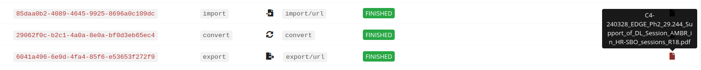

# PDF Converter
---

## Features:
---

1. Upload word documents (`.docx`).
2. Convert to pdf.
3. Download option not implemented yet.

## Usage:
---

1. Upload a `.docx` file.
2. The document will be uploaded to cloud and converted.
3. Since download option was not implemented yet, you can view the pdf on the dashboard.
  - View from dashboard (https://cloudconvert.com/dashboard/tasks):
  - 
